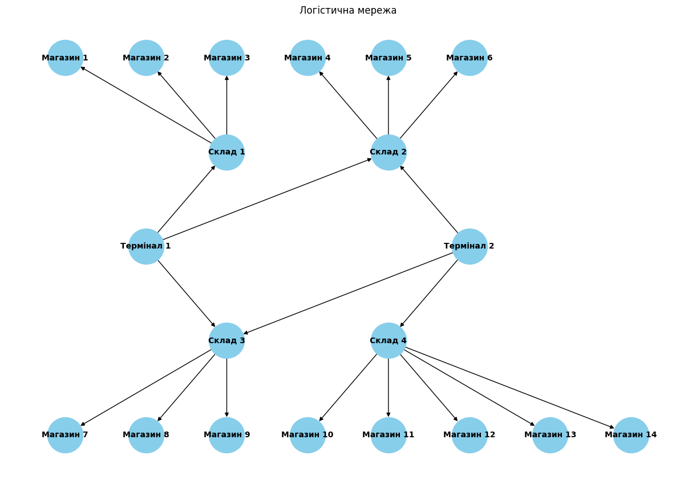

## “Просунуті структури для оптимізації та пошуку” (теми 3 та 4)

### Завдання 1. Застосування алгоритму максимального потоку для логістики товарів

Розробіть програму для моделювання мережі потоків для логістики товарів зі складів до магазинів, використовуючи алгоритм максимального потоку. Проведіть аналіз отриманих результатів і порівняйте їх з теоретичними знаннями.

#### Опис завдання

Побудуйте модель графа, що представляє мережу потоків у наступному зображені:


Зв'язки та пропускні здатності у графі мають наступний вигляд:




| Від        | До         | Пропускна здатність (одиниць) |
| ---------- | ---------- | ----------------------------- |
| Термінал 1 | Склад 1    | 25                            |
| Термінал 1 | Склад 2    | 20                            |
| Термінал 1 | Склад 3    | 15                            |
| Термінал 2 | Склад 3    | 15                            |
| Термінал 2 | Склад 4    | 30                            |
| Термінал 2 | Склад 2    | 10                            |
| Склад 1    | Магазин 1  | 15                            |
| Склад 1    | Магазин 2  | 10                            |
| Склад 1    | Магазин 3  | 20                            |
| Склад 2    | Магазин 4  | 15                            |
| Склад 2    | Магазин 5  | 10                            |
| Склад 2    | Магазин 6  | 25                            |
| Склад 3    | Магазин 7  | 20                            |
| Склад 3    | Магазин 8  | 15                            |
| Склад 3    | Магазин 9  | 10                            |
| Склад 4    | Магазин 10 | 20                            |
| Склад 4    | Магазин 11 | 10                            |
| Склад 4    | Магазин 12 | 15                            |
| Склад 4    | Магазин 13 | 5                             |
| Склад 4    | Магазин 14 | 10                            |


Застосуйте алгоритм максимального потоку для вирішення задачі. Напишіть програму, що реалізує алгоритм Едмондса-Карпа, або скористайтеся вже реалізованою версією для знаходження максимального потоку в побудованому графі. Проведіть аналіз отриманого результату. Чи досягнуто оптимального потоку, і що це означає для розглянутої мережі?

Оформіть звіт з розрахунками та поясненнями. Поясніть, які вершини та ребра було вибрано, як вони відповідають реальним елементам логістичної системи. Покажіть покроковий розрахунок максимального потоку та пояснити логіку кожного кроку.

#### Технічні умови

1. Використовуйте алгоритм Едмондса-Карпа для реалізації максимального потоку.
2. Побудова графа повинна відповідати наведеній структурі з 20 вершинами та заданими пропускними здатностями.


### Задача 2. Розширення функціоналу префіксного дерева

Реалізуйте два додаткових методи для класу `Trie`:

- `count_words_with_suffix(pattern)` для підрахунку кількості слів, що закінчуються заданим шаблоном;
- `has_prefix(prefix)` для перевірки наявності слів із заданим префіксом.

#### Шаблон програми
```python
from trie import Trie

class Homework(Trie):
    def count_words_with_suffix(self, pattern) -> int:
        pass

    def has_prefix(self, prefix) -> bool:
       pass

if __name__ == "__main__":
    trie = Homework()
    words = ["apple", "application", "banana", "cat"]
    for i, word in enumerate(words):
        trie.put(word, i)

    # Перевірка кількості слів, що закінчуються на заданий суфікс
    assert trie.count_words_with_suffix("e") == 1  # apple
    assert trie.count_words_with_suffix("ion") == 1  # application
    assert trie.count_words_with_suffix("a") == 1  # banana
    assert trie.count_words_with_suffix("at") == 1  # cat

    # Перевірка наявності префікса
    assert trie.has_prefix("app") == True  # apple, application
    assert trie.has_prefix("bat") == False
    assert trie.has_prefix("ban") == True  # banana
    assert trie.has_prefix("ca") == True  # cat
```


#### Технічні умови

- Клас `Homework` має успадковувати базовий клас `Trie`.
- Методи повинні опрацьовувати помилки введення некоректних даних.
- Вхідні параметри обох методів мають бути рядками.
- Метод `count_words_with_suffix` має повертати ціле число.
- Метод `has_prefix` має повертати булеве значення.

#### Критерії прийняття

1. Метод count_words_with_suffix повертає кількість слів, що закінчуються на заданий pattern. За відсутності слів повертає 0. Враховує регістр символів.
2. Метод has_prefix повертає True, якщо існує хоча б одне слово із заданим префіксом. Повертає False, якщо таких слів немає. Враховує регістр символів.
3. Код проходить усі тести.
4. Обробляються некоректні вхідні дані.
5. Методи працюють ефективно на великих наборах даних.
